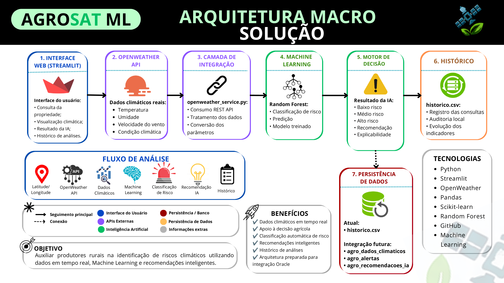

# 🌱 AGROSAT ML

Sistema inteligente de previsão de risco agrícola utilizando **OpenWeather API** e **Machine Learning**.

---

## 📌 Objetivo

O **AgroSat ML** tem como objetivo auxiliar produtores rurais na identificação de riscos climáticos que possam afetar suas plantações.

A aplicação coleta dados climáticos reais a partir da latitude e longitude de uma propriedade agrícola, processa essas informações com um modelo de Machine Learning e retorna uma classificação de risco climático.

---

## 🚀 Tema da Global Solution

O projeto está conectado à proposta da Global Solution por aplicar tecnologia, dados, APIs, automação e inteligência artificial em um problema real do agronegócio: o monitoramento climático de áreas agrícolas.

---

## 🧠 Trilha escolhida

A trilha escolhida foi:

**Machine Learning**

O sistema utiliza um modelo treinado para classificar o risco climático em três níveis:

* 🟢 Baixo risco climático
* 🟡 Médio risco climático
* 🔴 Alto risco climático

---

## 🛠️ Tecnologias utilizadas

* Python
* Streamlit
* Pandas
* Scikit-learn
* Joblib
* Requests
* OpenWeather API
* Random Forest Classifier
* CSV para histórico local

---

## 🔄 Como funciona o projeto

O fluxo da solução é:

```txt
dataset.csv
↓
train_model.py
↓
modelo_risco.pkl
↓
app.py
↓
OpenWeather API
↓
predict.py
↓
Resultado da IA
↓
historico.csv
```

Explicando de forma simples:

1. O arquivo `dataset.csv` contém dados climáticos simulados usados para treinar o modelo.
2. O arquivo `train_model.py` treina o modelo de Machine Learning.
3. Após o treinamento, é gerado o arquivo `modelo_risco.pkl`.
4. O dashboard é executado pelo arquivo `app.py`.
5. O usuário informa latitude e longitude da propriedade agrícola.
6. O sistema consulta a OpenWeather API.
7. Os dados climáticos reais são enviados para o modelo.
8. O modelo retorna o nível de risco climático.
9. O resultado é exibido no dashboard.
10. A análise é salva no arquivo `historico.csv`.

---

## 🌦️ Integração com OpenWeather

A integração com a OpenWeather acontece no arquivo:

```txt
openweather_service.py
```

A aplicação envia:

* Latitude
* Longitude
* API Key

E recebe dados climáticos em tempo real como:

* Temperatura
* Umidade
* Velocidade do vento
* Descrição climática
* Localidade identificada

---

## 🤖 Machine Learning

O modelo utilizado foi o:

```txt
Random Forest Classifier
```

Ele foi treinado com os seguintes dados:

* Temperatura
* Umidade
* Chance de chuva
* Velocidade do vento
* Risco climático

Classificação:

```txt
0 = Baixo risco
1 = Médio risco
2 = Alto risco
```

A acurácia obtida no treinamento foi de aproximadamente:

```txt
86%
```

---

## 🗄️ Integração com o banco AgroSat

Nesta versão, os dados das análises são armazenados localmente no arquivo:

```txt
historico.csv
```

O projeto também simula a integração com as tabelas do banco relacional do AgroSat:

* `agro_dados_climaticos`
* `agro_alertas`
* `agro_recomendacoes_ia`

Essas tabelas representam, respectivamente:

* Armazenamento dos dados climáticos coletados
* Registro dos alertas gerados pela IA
* Registro das recomendações inteligentes

---

## 🚀 Como executar o projeto

### 1️⃣ Clonar o repositório

```bash
git clone https://github.com/SulamitaViegas123/AGROSAT_API_ML.git
cd AGROSAT_API_ML
```

### 2️⃣ Instalar as dependências

```bash
pip install -r requirements.txt
```

### 3️⃣ Criar arquivo .env

Na raiz do projeto, criar um arquivo chamado:

```txt
.env
```

Conteúdo:

```env
OPENWEATHER_API_KEY=CHAVE_API
```

A chave pode ser obtida gratuitamente na OpenWeather.

### 4️⃣ Treinar o modelo

```bash
python train_model.py
```

Será gerado:

```txt
modelo_risco.pkl
```

### 5️⃣ Executar a aplicação

```bash
python -m streamlit run app.py
```

A aplicação ficará disponível em:

```txt
http://localhost:8501
```

---

## 🔑 Configuração da OpenWeather

O projeto utiliza uma chave da OpenWeather armazenada em variável de ambiente através do arquivo `.env`.

Essa abordagem evita expor credenciais diretamente no código-fonte e segue boas práticas de desenvolvimento.

---

## ✅ Resultado esperado

Após informar latitude e longitude, o sistema realiza:

* Consulta climática em tempo real utilizando a OpenWeather API;
* Identificação automática da localidade consultada;
* Coleta de temperatura, umidade, velocidade do vento e condição climática;
* Classificação do risco climático utilizando Machine Learning;
* Geração automática de recomendações;
* Registro da análise em histórico local;
* Simulação da integração com as tabelas do projeto AgroSat.

Além disso, o sistema disponibiliza um simulador técnico para validação do comportamento do modelo em cenários de baixo, médio e alto risco.

---

## 🗄️ Persistência de Dados

A versão atual utiliza:

```txt
historico.csv
```

para armazenamento local das análises realizadas.

A arquitetura foi preparada para futura integração com o banco de dados do projeto AgroSat através das tabelas:

* agro_dados_climaticos
* agro_alertas
* agro_recomendacoes_ia

---

## 📂 Estrutura do Projeto

```text
AGROSAT-ML
│
├── app.py
├── openweather_service.py
├── predict.py
├── train_model.py
├── dataset.csv
├── modelo_risco.pkl
├── historico.csv
├── requirements.txt
├── README.md
├── .gitignore
└── .env (não versionado)
```

---

## 👨‍💻 Status do Projeto

Projeto funcional com:

* ✅ Consulta climática via OpenWeather API
* ✅ Machine Learning com Random Forest
* ✅ Dashboard interativo em Streamlit
* ✅ Identificação automática da localidade
* ✅ Histórico de consultas por localidade
* ✅ Histórico persistido em CSV
* ✅ Simulador técnico do modelo
* ✅ Arquitetura documentada
* ✅ Diagrama da solução
* ✅ Documentação de execução
* ✅ Preparado para futura integração com banco relacional AgroSat

---
## 🏗️ Arquitetura da Solução

O diagrama abaixo apresenta a arquitetura macro do AgroSat ML, demonstrando o fluxo completo desde a coleta dos dados climáticos até a geração das recomendações inteligentes.


---

## 📚 Disciplina

Projeto desenvolvido para a disciplina:

**Disruptive Architectures: IoT, IoB & Generative IA**

Dentro da **Global Solution - FIAP**.

---

# 👥 Integrantes

| RM | Nome |
|---|---|
| RM560169 | Antonio de Luca Ribeiro Silva |
| RM560914 | Lucas Siqueira de Almeida |
| RM561090 | Matteus Viegas dos Santos |
| RM561089 | Sulamita Viegas dos Santos |
